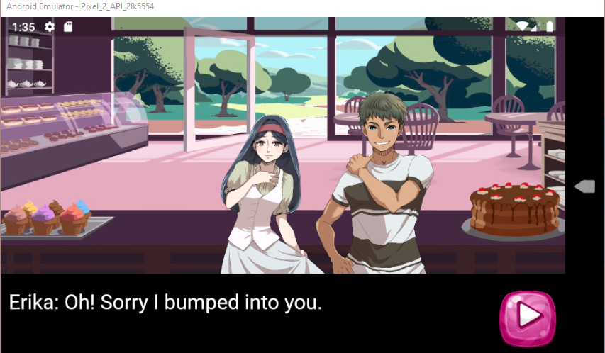

# Visual Novel

I used Flame to create this mobile game following CodeCakes tutorials. I learned how to use SpriteComponents,
and create dialog text boxes for the characters. 

https://caitlynbakery.github.io/Visual_Novel/